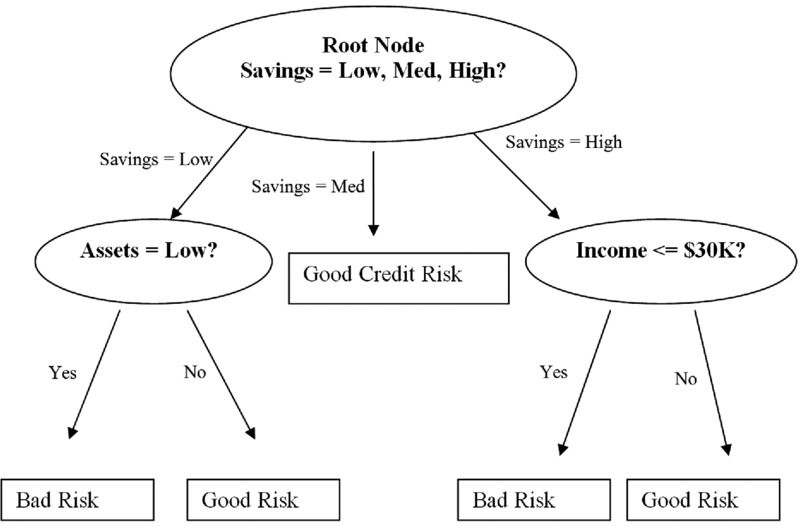

# Decision Tree Algorithm

## Introduction

A decision tree is a decision support tool that uses a tree-like graph or model of decisions. Tree based learning algorithms are considered to be one of the best and mostly used supervised learning methods. Tree based methods empower predictive models with high accuracy, stability and ease of interpretation. Unlike linear models, they map non-linear relationships quite well. They are adaptable at solving any kind of problem at hand (classification or regression).

## Example

</img>

Decision tree is normally used in classification and also the place where the values are categorical.

Decision trees have a natural “if … then … else …” construction that makes it fit easily into a programmatic structure. They also are well suited to categorization problems where attributes or features are systematically checked to determine a final category. For example, a decision tree could be used effectively to determine the species of an animal.

## Advantages

* Easy to understand and explore
* It implicitly perform feature engineering
* Non-linear relationships between parameters do not affect tree performance.

## Disadvantage

* May suffer from over fitting: captures noise from data
* Model can be unstable due to small variance in data
* Creates bias when some classes become dominate
* Complex when there are large number of labels

## Definitions

### Entropy

**Note:** When data gets large -> move to random forest

