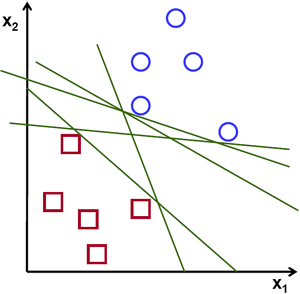
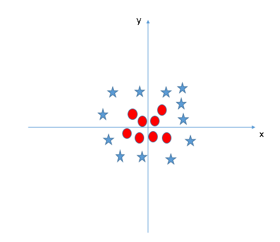

# Support Vector Machine

Support vector machine is highly preferred by many as it produces significant accuracy with less computation power. Support Vector Machine, abbreviated as SVM can be used for both regression and classification tasks. But, it is widely used in classification objectives.

The objective of SVM is to find a hyperplane in a N-Dimension space that distinctly classifies the data point (N = no. of features)

</img></img>

Our objective is to find a plane that has the maximum margin, i.e the maximum distance between data points of both classes. Maximizing the margin distance provides some reinforcement so that future data points can be classified with more confidence.

Hyperplanes are decision boundaries that help classify the data points. Data points falling on either side of the hyperplane can be attributed to different classes. Also, the dimension of the hyperplane depends upon the number of features. If the number of input features is 2, then the hyperplane is just a line. If the number of input features is 3, then the hyperplane becomes a two-dimensional plane. It becomes difficult to imagine when the number of features exceeds 3.

</img>

**Support vectors are data points that are closer to the hyperplane and influence the position and orientation of the hyperplane.** Using these support vectors, we maximize the margin of the classifier. Deleting the support vectors will change the position of the hyperplane. These are the points that help us build our SVM.

How to find hyper paramter of the image above?
</img>

Solution? SVM can solve this problem. Easily! It solves this problem by introducing additional feature. Here, we will add a new feature z = x2 + y2. Now, let’s plot the data points on axis x and z:

</img>

In the SVM classifier, it is easy to have a linear hyper-plane between these two classes. But, another burning question which arises is, should we need to add this feature manually to have a hyper-plane. No, the SVM  algorithm has a technique called the kernel trick. The SVM kernel is a function that takes low dimensional input space and transforms it to a higher dimensional space i.e. it converts not separable problem to separable problem. It is mostly useful in non-linear separation problem. Simply put, it does some extremely complex data transformations, then finds out the process to separate the data based on the labels or outputs you’ve defined.

**Pros:**

*    It works really well with a clear margin of separation
*    It is effective in high dimensional spaces.
*    It is effective in cases where the number of dimensions is greater than the number of samples.
*    It uses a subset of training points in the decision function (called support vectors), so it is also memory efficient.

**Cons:**

 *   It doesn’t perform well when we have large data set because the required training time is higher
*    It also doesn’t perform very well, when the data set has more noise i.e. target classes are overlapping. Sensitive to noisy data.
*   The algorithm is prone for over-fitting, if the number of features is much greater than the number of samples.